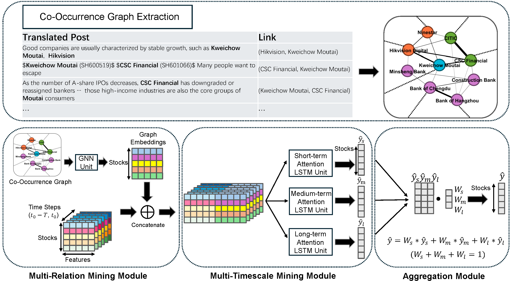

# COGRASP: Co-Occurrence Graph based Stock Price Forecasting

---

**A deep learning model for stock price prediction based on stock co-occurrence graph**

## 🧠 Introduction

<p align="center">
  
</p>The COGRASP model consists of three key modules:

Multi-Relation Mining Module: Constructs a stock co-occurrence graph based on investor comments from social media, financial news, and market information. A Graph Neural Network (GNN) is used to extract inter-stock relational features from the graph.

Multi-Timescale Mining Module: Captures multi-period information by analyzing individual stock trends over different timescales (e.g., daily, weekly, monthly).

Aggregation Module: Aggregates the multi-timescale features and integrates them with the inter-stock relations to generate the final stock trend predictions.

## 🏗️ Project Structure

```bash
.
├── data/               # Graph data and components codes of CSI300
├── model.py            # Model definition
├── utils.py            # Utility Functions
├── checkpoints.pt      # Pretrained model
├── main.py             # Training and evaluation process
├── requirements.txt    # requirements
└── README.md
```

## 🚀 Quick Start

### Environment Configuration

```bash
conda create -n COGRASP python=3.8
conda activate COGRASP 
pip install -r requirements.txt
```

### Data preparation

The `data/` directory contains only the graph structure. You must prepare your own historical time series data separately. We recommend using [Akshare](https://github.com/akfamily/akshare) to get these data.

### Usage

```bash
python main.py
```

## 📄 License

This project is licensed under the [MIT License](LICENSE).
